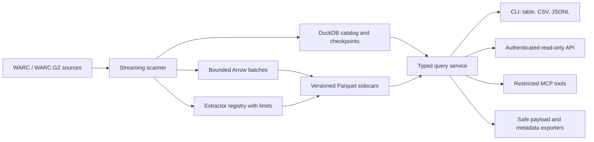

# Metawarc Repository Review and Improvement Plan

**Review date:** 2026-08-04

**Primary scope:** checked-out `master` at `94db570`

**Additional scope:** comparison with `testing` / tag `v1.3.1` at `c25c686`

## Executive summary

Metawarc has a useful core idea and a sensible storage model: scan WARC files once, keep a small DuckDB catalog, store record-level data in Parquet, and reuse that index for queries and extraction. The repository already covers the most important first workflows for archive inspection, and the newer `testing` branch adds a REST API, MCP server, modern packaging, CI, and an initial test suite.

The checked-out `master` branch is not release-ready. Several normal command paths fail, there are no tracked tests, installation metadata omits required runtime packages, and the implementation retains full record/header collections in memory despite claiming a low memory footprint. The most important repository-level issue is branch drift: the tagged `v1.3.1` implementation is on `testing`, while `master` still reports version `1.2.0` and lacks its features and fixes.

The recommended direction is:

1. Make the `testing`/`v1.3.1` work the candidate integration baseline.
2. Fix its indexing identity, data-path, security, dependency, and resource-management issues before promoting it to `master`.
3. Establish tests and quality gates around the actual CLI, extraction, dumping, API, and migration workflows.
4. Add new features only after the index format and public interfaces are stable.

## Review scope and validation

This review covered:

- all tracked Python source, packaging files, documentation, and git metadata on `master`;
- CLI help and isolated smoke tests using generated `.warc` and `.warc.gz` fixtures;
- static analysis with Ruff and Flake8;
- test collection on `master`;
- a read-only review of the newer `testing` branch;
- tests, coverage, and static analysis against a temporary exported snapshot of `testing`.

Existing untracked and ignored workspace files were not modified or treated as part of the checked-out `master` implementation.

### Validation results

| Check | Result |
|---|---|
| Parse all tracked Python modules on `master` | Passed |
| Tracked tests on `master` | No tests collected |
| Ruff on `master` | 54 findings, including 2 undefined names |
| Flake8 on `master` | 653 findings with the repository configuration |
| Index an uncompressed `.warc` on `master` | Failed with `TypeError` in basename handling |
| Index a `.warc.gz` normally on `master` | Passed for a one-record fixture |
| Index a `.warc.gz` with `--silent` on `master` | Failed because `ArchiveIterator.iterable` does not exist |
| Open a missing database through `list-files` on `master` | Created an empty database, then failed with a catalog error |
| Run `get` or `dump-metadata` with a missing database on `master` | Failed with `NameError` |
| Tests on exported `testing` / `v1.3.1` | 13 passed, with 2 dependency deprecation warnings |
| Coverage on `testing` / `v1.3.1` | 39% overall |
| Ruff on `testing` / `v1.3.1` | 33 findings |

## Current feature inventory

### Features present on `master`

| Area | Current implementation | Assessment |
|---|---|---|
| WARC indexing | `index` scans response records into DuckDB catalog tables and Parquet record/header sidecars | Good product foundation, but uncompressed and silent paths are broken |
| Typed content indexing | `index-content` extracts links and metadata groups for PDF, image, OOXML, and OLE documents | Useful, but input filtering and validation are defective; extraction is not resource-safe |
| Statistics | `stats` groups indexed content by MIME type or extension | Useful basic summary; hard-coded to `data/*_records.parquet` |
| Record listing | `list-files` filters by MIME, extension, or a SQL fragment and writes a Rich table or CSV | Useful, but database/path selection and SQL construction need redesign |
| Bulk payload export | `dump` extracts matching payloads and creates `records.csv` | Useful archival workflow; collision, path-safety, limit, and cleanup behavior need work |
| Single-record export | `get` locates a record by URL or WARC ID | Intended behavior exists, but missing-database and default-output behavior are incorrect |
| Metadata export | `dump-metadata` emits JSON Lines to stdout or a file | Useful, but the CLI input glob is broken and serialization is fully materialized through pandas |
| Format support | PDF, OLE Office, OOXML Office, common images, and HTML links | Appropriate initial set; MIME/extension handling is inconsistent |
| Legacy utilities | `Analyzer`, `Extractor`, SQLAlchemy `Record`, and utilities remain in the tree | Mostly disconnected from the active CLI and increase maintenance cost |

### Additional features on `testing` / `v1.3.1`

The newer branch already implements work that should not be recreated independently:

- a single, cleaner Click command group with `--version`;
- WARC IDs in the catalog to avoid Parquet basename collisions;
- database helpers and basic rejection of dangerous SQL fragments;
- REST endpoints for WARC listing, record listing, record metadata, headers, and payload streaming;
- an MCP server generated from the FastAPI application;
- environment-based configuration and structured logging;
- `pyproject.toml`, development extras, a CI workflow, and package data declarations;
- 13 initial tests covering indexing, database filters, and API happy paths;
- updated Markdown documentation and changelog.

These are branch-only features from the perspective of the checked-out `master`. They should be reviewed, hardened, and integrated before they are described as the canonical repository feature set.

## What is working well

- DuckDB plus Parquet is a pragmatic fit for large, read-heavy archive metadata.
- Keeping payload bytes in the source WARC avoids duplicating the largest data.
- Record offsets make targeted extraction possible without sequentially replaying the entire archive.
- CLI commands map to understandable archive workflows: index, inspect, filter, extract, and export.
- MIME maps and metadata group definitions provide a natural base for an extractor registry.
- Payload export is chunked instead of loading every selected payload into memory.
- The `testing` branch has started centralizing database behavior and closing connections reliably in dump operations.
- The generated tests use real WARC fixtures rather than only mocking the archive layer.

## Code-quality and product risks

### P0: release blockers

#### 1. Canonical branch and release state are inconsistent

`master` is version `1.2.0`; `testing` contains and tags `v1.3.1`. Packaging, documentation, feature inventory, tests, and CI therefore depend on which branch a contributor happens to inspect. This creates a high risk of fixing old code, publishing the wrong artifact, or documenting features that are not on the default branch.

**Required change:** choose one canonical branch, preserve the `testing` history, and promote it through a reviewed integration pull request after the P0 items below pass.

#### 2. Core indexing has reproducible failures on `master`

- `.warc` basename handling performs string subtraction instead of assignment.
- silent indexing reads offsets through a `tqdm`-specific `.iterable` property even when no `tqdm` wrapper exists.
- malformed/missing WARC headers and alternate WARC date/status forms can terminate a full scan.
- empty-result paths can create schema-less Arrow tables and invalid catalog inserts.
- the `--tables` argument is ignored by `index`, while `--update` defaults to true as a one-way flag.

The newer branch fixes the first two issues, but it generates a fresh random WARC file ID on each index run. As a result, its `--rescan`/skip behavior is not stable, repeated indexing can orphan old sidecars, and the `files.filename` primary key can replace catalog rows while leaving table rows behind.

**Required change:** define stable archive identity and explicit update semantics before the index schema is considered stable.

#### 3. Public query construction is not safe enough

`master` interpolates file paths, WARC IDs, URLs, MIME values, extension values, and raw query fragments into SQL. The `testing` branch adds a regular-expression blocklist, but continues to expose a user-supplied SQL fragment through the unauthenticated REST API and interpolates identifiers and file paths.

A blocklist cannot make arbitrary SQL safe. Read-only DuckDB sessions may still allow data-reading functions or expensive queries. The API also binds to `0.0.0.0` by default and has no authentication or request-cost controls.

**Required change:** remove raw SQL from the network API, use typed filters and bound parameters for values, resolve sidecar paths through the catalog, default servers to loopback, and require an explicit unsafe/trusted mode for local advanced SQL.

#### 4. Packaging does not describe the running application on `master`

`setup.py` omits DuckDB, PyArrow, Beautiful Soup, tqdm, and tabulate even though active modules import them. `requirements.txt` and `setup.py` disagree; `bs4` is used instead of the canonical distribution name; `pdfminer` is ambiguous; the wheel is marked universal despite Python 3-only classifiers; and the license classifier says BSD while the repository license is MIT.

The `testing` branch largely corrects this with `pyproject.toml`, but still uses pandas-returning DuckDB methods without declaring pandas. API and MCP dependencies are mandatory even for CLI-only users.

**Required change:** use one dependency source, add clean-environment wheel/sdist smoke tests, and split optional server/MCP dependencies from the core CLI.

### P1: high-priority engineering risks

#### 5. The indexer is not low-memory

All record rows and all HTTP header rows for a WARC are accumulated in Python lists before a Parquet write. Typed metadata indexing also accumulates every extracted item for a WARC. A large crawl can exhaust memory, and a failure near the end loses all progress for that input.

**Required change:** write bounded Arrow/Parquet batches, checkpoint catalog progress, and atomically rename completed sidecars.

#### 6. Paths are coupled to the process working directory

Sidecars are always written under `./data`, and statistics/API paths use `data/*_records.parquet` rather than the catalog. Moving the database, starting the API from another directory, or managing multiple indexes in one working directory can produce missing or cross-contaminated results.

**Required change:** introduce an index workspace whose database and sidecars share an explicit root, store normalized paths, and query registered catalog entries instead of a global glob.

#### 7. Resource handling and extraction safety are weak

- Many WARC, PDF, ZIP, CSV, and output handles are not managed with context managers.
- metadata extraction creates a permanent temporary file for every record because both branches set `delete=False` and never unlink it;
- early returns leak those temporary files;
- OOXML ZIP/XML parsing has no size, member-count, or decompression limits;
- broad exceptions hide parser failures;
- entire content bodies are copied before link parsing or metadata extraction.

**Required change:** enforce cleanup with `try/finally`, add configurable per-record byte/time limits, use safe XML/ZIP handling, and record structured extraction errors without aborting the archive.

#### 8. Dumping needs correctness and safety controls

Export filenames are derived from an untrusted WARC record ID, duplicate IDs overwrite each other, unknown MIME types lose useful URL extensions, all selected rows are retained in memory, and opened WARC handles are not always closed. Query paths can also return an unlimited number of records despite method defaults.

**Required change:** sanitize and uniquify output names, enforce record/byte limits, stream query results by archive, preserve manifest-to-file mappings, and close every handle.

#### 9. Tests do not protect the full product surface

`master` tracks no tests. The newer branch's 13 tests are a good start but cover 39% overall and leave the CLI entry points, extractor, dump/get workflows, content indexing, server streaming, malformed WARC behavior, updates, rescans, migrations, and security boundaries mostly untested.

**Required change:** build a fixture matrix and add coverage gates based on critical paths rather than chasing a single repository-wide percentage.

### P2: maintainability and user-experience issues

- The code has large methods, repeated query/export logic, partial type hints, broad exception handling, and many unused imports/variables.
- `Analyzer`, `utils.py`, and the SQLAlchemy model appear disconnected from the current architecture.
- command flags and database option names are inconsistent (`-i`, `-d`, `-o`, `tofile`, and `dbfile`).
- expected user errors often print a message and return success; other errors raise internal tracebacks.
- README claims for test coverage and low memory do not match `master` behavior.
- README alternates between `metawarc.db` and `warcindex.db`.
- no schema version or migration mechanism exists for DuckDB/Parquet changes.
- CI on the newer branch lints only a selected subset of files, allowing known issues elsewhere.
- IDE project files are tracked while contributor, security, architecture, and release documents are absent.

## Proposed target architecture

Keep the DuckDB/Parquet design, but establish explicit boundaries between input scanning, catalog state, sidecar writing, querying, extraction, and interfaces.

Suggested module boundaries:

- `catalog/`: schema, migrations, archive identity, transactions, path resolution;
- `indexing/`: WARC scanning, normalization, batch writers, checkpoints;
- `extractors/`: one implementation per content group behind a common interface;
- `query/`: typed filters, pagination, sorting, and result iteration;
- `export/`: payload, CSV, JSONL, and manifest writers;
- `cli/`: Click adapters and exit-code/error translation;
- `api/`: FastAPI models, dependencies, authentication, and streaming adapters;
- `mcp/`: a small allowlisted tool surface built on the query service.

## Prioritized implementation roadmap

### Phase 0 — consolidate the repository baseline

| ID | Task | Effort | Acceptance criteria |
|---|---|---:|---|
| R0.1 | Create an integration branch from `testing` and review the `master..testing` delta | S | All newer work is represented in one reviewable change; no user workspace artifacts are included |
| R0.2 | Decide canonical default branch and repository URL | S | README, package metadata, remote documentation, issue links, and release workflow agree |
| R0.3 | Add a schema/version compatibility note for existing `master` indexes | M | Upgrade, rebuild, and rollback behavior are documented before promotion |
| R0.4 | Promote only after P0 tests below pass | S | Default branch, version tag, changelog, and built package come from the same commit |

### Phase 1 — make existing CLI workflows reliable

| ID | Task | Effort | Acceptance criteria |
|---|---|---:|---|
| R1.1 | Implement stable WARC identity and explicit `add`, `update`, `rescan`, and `force` semantics | L | Re-indexing the same source is idempotent; changed sources are detected; no orphan sidecars remain |
| R1.2 | Introduce an index workspace / `--data-dir` and catalog-based path resolution | L | Commands work from any current directory and with multiple databases; duplicate basenames do not collide |
| R1.3 | Fix uncompressed, compressed, silent, empty, malformed, and partial-header indexing | M | Fixture matrix passes without whole-run failure; skipped/error counts are reported |
| R1.4 | Replace pandas-dependent `.df()` calls or declare a deliberate pandas dependency | M | All core commands run in a clean core-only environment |
| R1.5 | Centralize typed filters and parameter binding | M | MIME, extension, URL, ID, date, status, size, sort, offset, and limit share one implementation |
| R1.6 | Make CLI errors and exit codes consistent | M | Invalid input is exit 2; missing data is nonzero with a concise message; internal errors are logged once |
| R1.7 | Make dump/get filenames safe and collision-free | M | No path traversal or silent overwrite; manifest records the chosen path and original identifiers |
| R1.8 | Remove or migrate dead modules | S | Each retained module has a caller and tests; unused SQLAlchemy dependency is removed if models are retired |

### Phase 2 — improve scalability and extraction quality

| ID | Task | Effort | Acceptance criteria |
|---|---|---:|---|
| R2.1 | Write records, headers, links, and metadata in bounded batches | L | Peak memory remains bounded as WARC record count grows; batch size is configurable |
| R2.2 | Add atomic sidecar creation and catalog transactions | M | Interrupted scans leave recoverable partial state and never register incomplete files as complete |
| R2.3 | Add extractor registry and normalized result envelope | L | Each extractor returns versioned metadata, warnings, duration, bytes read, and a stable error code |
| R2.4 | Add extraction limits and cleanup | M | Temporary files are always removed; ZIP/XML limits and per-record byte/time limits are enforced |
| R2.5 | Improve content detection | M | Matching combines normalized MIME, URL extension, and optional magic-byte detection; parameters/case are handled |
| R2.6 | Add `validate` / `doctor` command | M | Verifies schema version, catalog-sidecar links, source availability/fingerprints, Parquet readability, and orphan files |
| R2.7 | Add structured progress and run summaries | S | Every command reports processed, matched, skipped, failed, bytes, and elapsed time in human and JSON modes |

### Phase 3 — safely ship API and MCP features

| ID | Task | Effort | Acceptance criteria |
|---|---|---:|---|
| R3.1 | Remove arbitrary SQL from network interfaces | M | API/MCP accept only typed allowlisted filters; security tests cover injection and file-reading attempts |
| R3.2 | Add response models and stable error schema | M | OpenAPI describes every success/error response and pagination envelope |
| R3.3 | Secure server defaults | M | Default bind is `127.0.0.1`; non-loopback use warns or requires configured authentication |
| R3.4 | Add request limits and cancellation-safe streaming | M | Page/byte/time limits are enforced and WARC handles close on disconnect |
| R3.5 | Make MCP tools explicit instead of exposing the whole API automatically | M | Tool list is small, read-only, documented, and excludes raw queries and unrestricted file access |
| R3.6 | Split install extras | S | `metawarc` installs CLI core; `[api]`, `[mcp]`, and `[all]` add optional interfaces |

### Phase 4 — add new user-facing capabilities

Prioritize features that build directly on the stable index rather than creating a second storage path.

| ID | Feature | Priority | Product value | Initial scope |
|---|---|---:|---|---|
| F4.1 | Collection summary report | High | Quickly assesses a crawl | Counts/bytes by MIME, extension, status, host, year, and top domains; JSON/CSV output |
| F4.2 | Content hashes and duplicate analysis | High | Finds duplicate payloads and saves extraction work | Optional SHA-256 during scan, duplicate groups, canonical record selection |
| F4.3 | Incremental collection ingestion | High | Supports recurring crawls | Add new WARCs without rescanning unchanged inputs; resumable run manifest |
| F4.4 | Rich typed filtering | High | Replaces unsafe SQL for most users | Date range, status family, host/domain, size, MIME, extension, URL pattern, sort, pagination |
| F4.5 | Link graph analysis | Medium | Makes link extraction actionable | Resolve relative links, normalize targets, internal/external classification, domain edge summaries |
| F4.6 | Metadata schema and export formats | Medium | Improves downstream reuse | Stable flattened fields plus raw extractor output; JSONL, CSV, and Parquet exports |
| F4.7 | WARC integrity report | Medium | Supports preservation workflows | Record/header validation, truncated payload detection, digest verification when available |
| F4.8 | Search index | Medium | Finds archived content beyond URL metadata | Optional extracted-text/full-text module, clearly separated from core metadata indexing |
| F4.9 | Batch job API | Later | Enables large remote operations | Submit/status/cancel jobs after authentication, quotas, and durable job state exist |
| F4.10 | Web exploration UI | Later | Improves accessibility | Read-only dashboard built only after the query API is stable |

## Test and quality plan

### Required fixture matrix

- `.warc` and `.warc.gz`;
- zero-record and no-response archives;
- missing HTTP headers and missing/invalid WARC headers;
- HTML, PDF, OOXML, OLE, image, unknown MIME, and mismatched MIME/extension;
- duplicate basenames in different directories;
- duplicate record IDs and unsafe record-ID characters;
- large headers and payloads above configured limits;
- corrupt ZIP, XML, PDF, and image payloads;
- interrupted scan followed by resume;
- unchanged, changed, moved, and deleted source WARCs;
- old schema opened by a new release;
- missing, corrupt, moved, and orphan Parquet sidecars.

### Test layers

1. **Unit tests:** MIME normalization, path resolution, identity/fingerprints, filters, serializers, and filename sanitization.
2. **Integration tests:** real WARC to DuckDB/Parquet to list/dump/get/metadata workflows.
3. **CLI tests:** `CliRunner` coverage for every command, option, exit code, stdout/stderr contract, and JSON mode.
4. **API/MCP tests:** authentication, typed filters, pagination, limits, disconnects, path traversal, and injection attempts.
5. **Performance tests:** bounded-memory indexing and extraction with a generated high-record-count archive.
6. **Packaging tests:** build wheel/sdist, install each extras combination into a clean environment, run `--version` and a smoke workflow.
7. **Migration tests:** open or migrate representative indexes from every supported schema version.

### Quality gates

- Run Ruff (or another single chosen linter/formatter) over the entire tracked Python tree, not a hand-selected subset.
- Add type checking to catalog, query, indexing, and API boundary modules first.
- Require all critical workflow tests regardless of aggregate coverage.
- Raise coverage in stages: first protect the critical index/query/export paths, then set a repository-wide gate.
- Treat resource/deprecation warnings as tracked work; run a scheduled job against dependency updates.
- Add dependency vulnerability scanning, a generated SBOM for releases, and secret scanning.

## Documentation and release plan

1. Replace conflicting README claims with tested behavior and clearly label optional API/MCP features.
2. Document the index workspace layout, catalog schema, path portability, and schema-version policy.
3. Add an architecture decision record for DuckDB/Parquet and stable WARC identity.
4. Add `CONTRIBUTING.md`, `SECURITY.md`, support policy, and release checklist.
5. Generate CLI reference from Click help or test every documented invocation.
6. Publish compatibility notes for `master` 1.2 indexes and `testing` 1.3 indexes.
7. Build and install artifacts in CI before creating a tag; publish from the exact tagged commit.

Suggested release sequence:

- **Stabilization release:** branch consolidation, packaging, indexing correctness, path handling, tests, and documentation alignment.
- **Interface release:** secure typed REST API and restricted MCP tools, plus `doctor` and machine-readable CLI output.
- **Next major release:** versioned index workspace, streaming/batched indexing, migrations, extractor registry, and incremental ingestion.

## Definition of done for the stabilization release

- `master`, package version, tag, changelog, and documentation identify the same release.
- Clean core installation can run all CLI smoke tests without undeclared packages.
- Both `.warc` and `.warc.gz` pass normal and silent indexing tests.
- Re-index/update/rescan semantics are idempotent and leave no orphan catalog or sidecar state.
- All paths resolve relative to an explicit index workspace, not the caller's current directory.
- Missing/corrupt input produces a concise nonzero CLI result rather than a traceback or a newly created empty database.
- Dump/get cannot traverse directories or silently overwrite another selected record.
- Every opened file, database connection, parser, and temporary file is closed or removed on success, error, and cancellation.
- Network interfaces do not accept raw SQL and do not bind publicly by default.
- Critical end-to-end workflows, packaging, and schema compatibility run in CI.
- README commands are executed as documentation tests or covered by equivalent CLI tests.

## Recommended first five changes

1. Open a consolidation change from `testing` to an integration branch and make branch/version ownership explicit.
2. Replace random per-run WARC IDs with stable identity plus catalog migration and correct update/rescan behavior.
3. Introduce an explicit index workspace and remove every hard-coded `data/*` lookup.
4. Replace interpolated/public raw SQL with one typed, parameterized query service shared by CLI, API, and MCP.
5. Add end-to-end tests for compressed/uncompressed indexing, update/rescan, list/dump/get, extraction cleanup, and clean package installation before adding more product surface.
